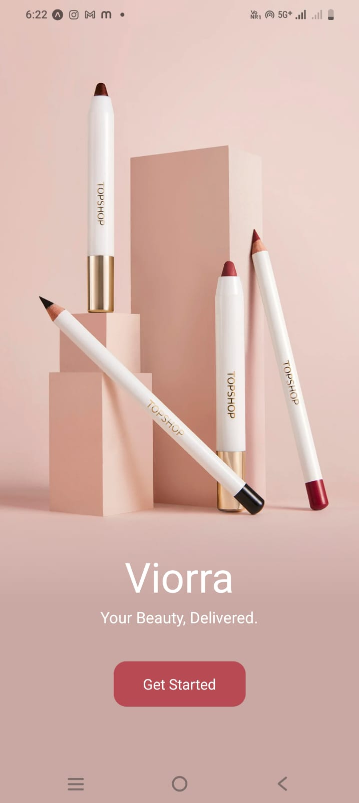

# GlowCart (React Native / Expo)

> ⚠️ **Note**: The assignment instructed me to build this project using **React Native CLI**.  
> Due to laptop performance issues, I built it with **Expo (Managed Workflow)**.  
> The code and structure are fully compatible with React Native CLI if migrated later.

---

## 📌 What Was Asked in the Assignment
According to the assignment PDF:
- Build an **E-Commerce App** with the following screens:
  - Onboarding  
  - Login  
  - Register  
  - Home (Product List)  
  - Product Details  
  - Profile  
- Use **React Navigation** for navigation.  
- Use **Context API** (or Redux/Zustand) for state management.  
- Fetch data from the **DummyJSON API** (`https://dummyjson.com/products`).  
- Use **FlatList** for product listing.  
- Create **reusable components** (Header, Product Card, Button, etc.).  
- Show **Product Details** with: Image, Title, Description, Price, Add to Bag, Highlights, Reviews.  
- Deliver with a **README, screenshots, and screen recording**.

---

## ✅ What I Have Built
I implemented all the asked functionality **and also added extra improvements** for better user experience:

### 1. Onboarding Screen
- Beautiful onboarding with **brand tagline** and gradient image background.  
- **Get Started** button → navigates to **Login** screen.

### 2. Register Screen (Extra Features Added ✅)
- Inputs: Full Name, Email, Password, Confirm Password.  
- **Validations Added**:
  - All fields must be filled.  
  - Email must be valid format.  
  - Password must be at least 6 characters.  
  - Password and Confirm Password must match.  
- Password fields include **show/hide toggle**.  
- On successful registration:
  - User credentials stored in **AsyncStorage**.  
  - Redirects to Login with success alert.

### 3. Login Screen (Extra Features Added ✅)
- Inputs: Email + Password.  
- **Validation Added**:
  - Checks empty fields.  
  - Validates email format.  
  - Matches credentials with stored data from **AsyncStorage**.  
- Only valid credentials allow access to the app.  
- Social login icons shown (Google, Apple, Facebook) using local PNG images.

### 4. Bottom Tab Navigation
- Tabs: **Home, Offers, Wishlist, Profile**.  
- Styled with **rounded corners + top border** (as shown in mock).  
- Each tab has **Ionicons** for clarity.  

### 5. Home Screen
- **Header Component** (Logo, Search, Cart, Notifications).  
- **FlatList** (2-column grid) showing products with:
  - Product image inside a styled pink wrapper.  
  - Title & price.  
  - Wishlist heart toggle button.  
- Products fetched from **DummyJSON API** via **Context API**.  
- **Reusable ProductCard** component used for each item.  

### 6. Product Details (Modal)
- Opens as **modal** when a product card is clicked.  
- Includes:
  - Large product image.  
  - **Back arrow & Bag icons** on top.  
  - **View Similar** (touchable button) + **Share** (icon) row.  
  - Product **title, description, brand**.  
  - Product **price + Add to Bag** button.  
  - **Highlights section** with vertical divider → showing Weight, Warranty, Shipping.  
  - **Ratings & Reviews** with reviewer name, email, star rating (⭐), and comment.  
  - Properly styled **Close button** to dismiss modal.  

### 7. Profile Screen (Extra Features Added ✅)
- Mock user info section (Avatar, Name, Email).  
- Settings: Address, Orders, Language, Help, Privacy Policy, etc.  
- **Logout function**:
  - Clears stored user data from AsyncStorage.  
  - Redirects user back to Login.  

---

## 🛠️ Tech Stack
- **Expo (Managed Workflow)**  
- **React Navigation (Stack + Bottom Tabs)**  
- **Context API** (Product & User state management)  
- **AsyncStorage** (login/register persistence)  
- **FlatList** (product grid)  
- **Reusable Components**: Header, ProductCard, CustomButton, RatingStars  
- **Vector Icons** + local PNG icons  

---

---

## 📸 Screenshots

| Onboarding | Login | Register |
|------------|-------|----------|
|  |  |  |

| Home | Product Details | Profile |
|------|----------------|---------|
|  |  |  |  |

---

## 🎥 Screen Recording
👉 [Watch Demo Video](docs/screenshots/demo.mp4) 

